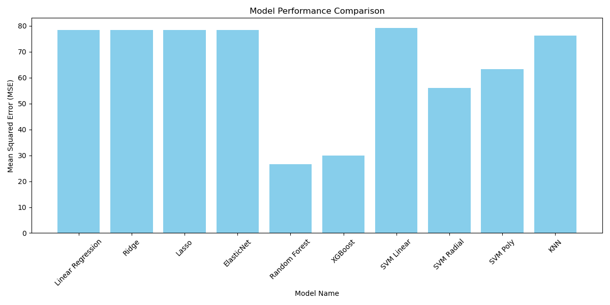

# aiap-bootcamp1-hoo-chi-yang

# U.A ML Pipeline

##  Details
- Name: Hoo Chi Yang
- Email: c-hi.yang@hotmail.sg

## Folder Overview
.\
├── eda.ipynb\
├── README.md\
├── requirements.txt\
├── run.sh\
├── Results.jpg\
├── .git\
├── .github\
├── data\
│   └── score.db\
└── src\
    ├── build_models.py\
    ├── dataloader.py\
    ├── model_mgr.py\
    ├── pipeline.py\
    ├── preprocessing.py\
    └── visualize.py

## Instructions for running and hyperparameter modification. 
- Pipeline can be run by executing `./run.sh`
- For modifying parameters, edit the values in `model_mgr.py`. 

## Pipeline
1. `dataloader.py`
   - `Dataloader` class handles data load.
   - check file exists
   - loads the data using sqlite3 into dataframe
3. `preprocessing.py`
   - `Preprocessor` class handles preprocessing tasks.
   - formats the data values
   - conducts feature engineering
   - data imputation & dropping missing values.
   - dummy variable encoding.
   - standardize the data using `StandardScaler`
   - conducts train-test split and returns `X_test`, `X_train`, `y_test`, `y_train`
4. `build_models.py`
   - `ModelBuilder` class handles model training and evaluation.
   - obtains paramters and models from `ModelMgr` from `model_mgr.py`
   - conduct model training and hyperparameter tuning.
   - evaluates model using testset and prints test errors.
5. `visualize.py`
    - `Visualizer` class visualizes model performance and output graph.     
6. `pipeline.py`
    - runs the pipeline.
    - loads data using `Dataloader`
    - preprocesses using `Preprocessor`
    - builds and evaluates model using `ModelBuilder`
    - output model performance using `Visualizer`
9. `run.sh`
    - executable to run `pipeline.py`

## Feature Preprocessing Summary

| Feature            | Processing Steps                                                                                                                                                                                                                                             |
|--------------------|--------------------------------------------------------------------------------------------------------------------------------------------------------------------------------------------------------------------------------------------------------------|
| `age`              | Filter only Secondary School age students 15-16.|
| `CCA`              | Text & Values standardized to 'None', 'Arts', 'Sports', 'Clubs'|
| `tuition`          | Values standardized to 'Yes' / 'No'|
| `hours_of_sleep`   | Duration between 'sleep_time', 'wake_time'. Original columns dropped.|
| `student_id`       | Dropped.|
| `index`            | Dropped.|
| `final_test`       | Missing values dropped.|
| `attendance_rate`  | Classified into `att_type` 'A', 'B', or 'C'. NaN values imputed based on the `final_test`.|
| `n_male` , `n_female` | Create features `class_size` (sum of male and female) and `school_type` (categorized into 'boy_sch', 'girl_sch', or 'mixed'). Original columns dropped.|
| Categorical vars   | Dummy variable encoded. Original categorical columns dropped.|
| Numerical vars     | Standardized using `StandardScaler`.|

## EDA Findings

- Based on EDA findings, histogram of residuals and Q-Q plot shows that residuals are approximately normal, Residual vs Fitted plot shows that there is some non-linearities that are not captured if we use a linear model. We expect that non-linear models may be better in predicting 'final_test' scores. 

- The variables effects on 'final_test' makes sense. 
- We expect that smaller 'class_size' may lead to better test outcomes due to more focus on individual students. 
- Students who do not have CCA are likely to have better test outcomes as they have more time to work on their studies. 
-'attendance_rate' greatly impacts 'final_test' scores. We interpret that there may be some scores reserved for attendance. 
- Students with access to 'tuition' are correlated to having better 'final_test' scores. 
- 'final_test' are less correlated to 'gender', 'mode_of_transport', 'school_type', 'bag_color', and 'age'.
- Unexpectedly, 'hours_per_week' of study have a slight negative correlation to 'final_test.' Perhaps maybe these are struggling students. 
- Also, it also seems like students with visual 'learning_style' are correlated to have better 'final_test.'

## Model Choices
Models selected are a mix of parametric & non-parametric, and linear & non-linear models, to test which types of models provide best performance.

List of models:
1. Parameteric, Linear
- Linear Regression
- With Regularization (Lasso, Ridge, ElasticNet)
- SVM (Linear)
2. Parametric, Non-Linear
- SVM (Poly, Radial)
3. Non-Parametric, Non-Linear
- KNN
- Random Forest, XGBoost

## Model Evaluation

Models are trained using 5 folds cross-validation and gridsearchCV over hyperparameters listed in `model_mgr.py` for hyperparameter tuning. 
Models are evaluated based on testset MSE between predictions and true values. Model with the lowest testset MSE is evaluated as the best model. 

Hyperparamters to be tested in `model_mgr.py`:

| Model           | Hyperparameters                                                                                     |
|-----------------|----------------------------------------------------------------------------------------------------|
| Ridge           | `{'model__alpha': [0.001, 0.01, 0.1, 1, 10, 100]}`|
| Lasso           | `{'model__alpha': [0.001, 0.01, 0.1, 1, 10, 100]}`|
| ElasticNet      | `{'model__alpha': [0.001, 0.01, 0.1, 1, 10, 100], 'model__l1_ratio': [0.2, 0.5, 0.8]}`|
| Random Forest   | `{'model__n_estimators': [50, 100, 200], 'model__max_depth': [None, 10, 20, 30], 'model__min_samples_split': [2, 5, 10]}` |
| XGBoost         | `{'model__n_estimators': [50, 100, 200], 'model__max_depth': [3,5,7], 'model__learning_rate': [0.01, 0.5, 1], 'model__subsample': [0.5, 0.7, 1], 'model__colsample_bytree': [0.5, 0.7, 1]}` |
| SVM Linear      | `{'model__C': [0.1, 1, 10], 'model__kernel': ['linear']}`|
| SVM Radial      | `{'model__C': [0.1, 1, 10], 'model__kernel': ['rbf']}`|
| SVM Poly        | `{'model__C': [0.1, 1, 10], 'model__kernel': ['poly'], 'model__degree': [2, 3]}`|
| KNN             | `{'model__n_neighbors': [3, 5, 7], 'model__weights': ['uniform', 'distance']}`|

Below are the results: 

| Model           | Best Parameters                                                   | Best CV Score | Test MSE           |
|-----------------|-------------------------------------------------------------------|-----------------------------|--------------------|
| Linear Regression | `{}`| 78.6164520814928|78.40808777019475|
| Ridge             | `{'model__alpha': 10}`|78.61575778595065|78.40971494992637|
| Lasso             | `{'model__alpha': 0.01}`| 78.58978373206449 | 78.39838153489376|
| ElasticNet        | `{'model__alpha': 0.01, 'model__l1_ratio': 0.8}` | 78.59462763932376  | 78.40406466120936 |
| Random Forest     | `{'model__max_depth': 10, 'model__min_samples_split': 10, 'model__n_estimators': 200}` | 28.28978533199007 | 26.610824603156797 |
| XGBoost           | `{'model__colsample_bytree': 1, 'model__learning_rate': 0.5, 'model__max_depth': 5, 'model__n_estimators': 50, 'model__subsample': 1}` | 31.57206820413258 | 29.82944792196203  |
| SVM Linear        | `{'model__C': 1, 'model__kernel': 'linear'}` | 79.04817897351535| 79.0875049273558|
| SVM Radial        | `{'model__C': 10, 'model__kernel': 'rbf'}`| 59.03509738200438| 56.06850993630905|
| SVM Poly          | `{'model__C': 10, 'model__degree': 3, 'model__kernel': 'poly'}` | 65.6610019696263| 63.27527569976111|
| KNN               | `{'model__n_neighbors': 7, 'model__weights': 'distance'}`| 75.10440697379228| 76.21880437341136|

Random Forest features ranking of descending Importance:

| Rank | Feature                               | Importance |
|------|---------------------------------------|------------|
| 1    | class_size| 0.386933|
| 2    | number_of_siblings_2| 0.159365|
| 3    | number_of_siblings_1| 0.107700|
| 4    | hours_per_week| 0.107155   |
| 5    | learning_style_Visual| 0.085111|
| 6    | attendance_rate| 0.065401|
| 7    | direct_admission_Yes| 0.033158|
| 8    | tuition_Yes| 0.029173|
| 9    | CCA_None| 0.011408|
| 10   | gender_Male|0.002546|
| 11   | att_type_B| 0.001263   |
| 12   | age_16.0| 0.001135   |
| 13   | mode_of_transport_walk|0.001124   |
| 14   | hours_of_sleep| 0.001089   |
| 15   | bag_color_yellow| 0.001009|
| 16   | bag_color_red| 0.000963|
| 17   | CCA_Clubs| 0.000830   |
| 18   | mode_of_transport_public transport| 0.000803|
| 19   | bag_color_blue| 0.000745|
| 20   | school_type_mixed| 0.000682|
| 21   | bag_color_white| 0.000664|
| 22   | CCA_Sports| 0.000661|
| 23   | bag_color_green|0.000605   |
| 24   | school_type_girl_sch| 0.000455|
| 25   | att_type_C| 0.000023|

## Discussion

- Based on the test performance, we note that non-linear models work better compared to linear models (this has been previously observed in the EDA). 
- Tree-based methods is shown to work very well, followed by SVM radial.
- Linear models show poor test performance, with minimal improvements seen with regularization.
- This indicates that linear models are unsuitable for predicting `final_test` scores. 

## Limitations and Further Improvement
- Hyperparameter tuning in this project only search through a small range of values. More experimentations with hyperparameters could improve performance. 
- Other non-parametric non-linear models such as neural networks should be explored. 
